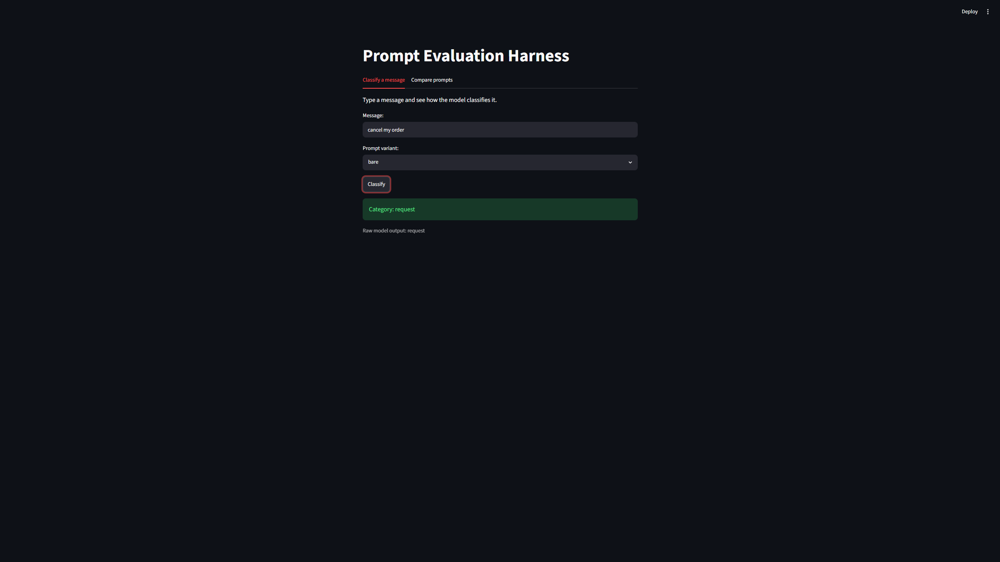
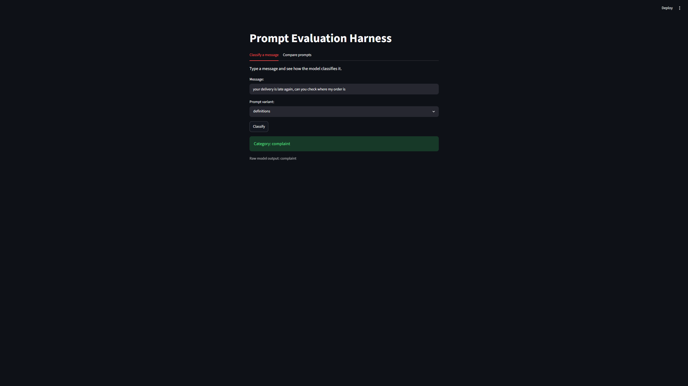
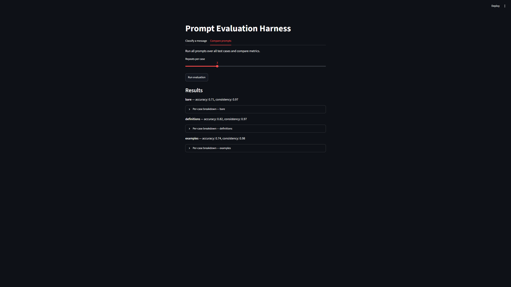

# Prompt Evaluation Harness

A local tool for comparing LLM prompt variants on a text classification task. It measures which prompt classifies customer support messages most **accurately** and most **consistently**, running fully offline on a local model via Ollama.

## Overview

Customer messages are sorted into one of four categories: `spam`, `question`, `complaint`, or `request`. The harness compares three prompt strategies and reports how well each one performs, so you can see which prompting approach actually works best for this task instead of guessing.

It has two parts:
- an **interactive classifier** where you type a message and see the predicted category
- a **prompt comparison** that runs every prompt over a labeled test set and reports metrics

## Prompt strategies compared

| Strategy | Description |
|---|---|
| `bare` | Zero-shot: just asks for the category, no extra guidance |
| `definitions` | Adds a short definition of each category to the prompt |
| `examples` | Few-shot: shows a few labeled examples before the message |

## Metrics

For each prompt, two separate metrics are reported:

- **Accuracy** — how often the model's answer matches the human-labeled category
- **Consistency** — how often the model gives the same answer across repeated runs on the same input

These measure different things. A prompt can be consistent but wrong (the model confidently gives the same incorrect answer every time), or accurate but unstable. Tracking both gives a fuller picture than accuracy alone.

## How it works

```
cases.py       labeled test messages (the gold standard)
prompts.py     the three prompt templates
runner.py      builds prompts, calls the model, parses answers
evaluator.py   scores accuracy and consistency
app.py         Streamlit interface (classifier + comparison)
main.py        command-line entry point for a full run
```

Each message is sent to the model several times per prompt, the raw outputs are parsed down to a clean category, and the results are compared against the labeled answer.

## Requirements

- Python 3.12+
- [Ollama](https://ollama.com) installed and running
- The model pulled locally:

```bash
ollama pull qwen3:8b
```

This project uses `qwen3:8b` for classification accuracy. The model runs locally on your machine, so a working Ollama installation is required to run the app.

## Setup

```bash
pip install -r requirements.txt
```

## Usage

Run the full evaluation from the command line:

```bash
python main.py
```

Or launch the interactive app:

```bash
streamlit run app.py
```

## Screenshots

### Interactive classifier


### Handling an ambiguous message


### Comparing prompts


## Findings

On a 22-case test set with `qwen3:8b` (3 repeats per case), the prompts diverged in a meaningful way:

| Prompt | Accuracy | Consistency |
|---|---|---|
| `bare` | 0.71 | 0.97 |
| `definitions` | 0.82 | 0.97 |
| `examples` | 0.74 | 0.98 |

Two observations stood out:

- Adding category definitions clearly helped. `definitions` beat the bare zero-shot prompt by a solid margin (0.82 vs 0.71), confirming that spelling out the boundary between classes pays off on this task.
- The model was highly consistent even when wrong — it repeated the same answer across runs regardless of whether it matched the label. High consistency does not imply correctness. On ambiguous cases (for example, a message that mixes a complaint with a request), the gap between the model's reading and the human label was often larger than the gap between prompts, which points to the inherent ambiguity of edge cases rather than the prompt wording.

## Possible next steps

- Constrain output with structured generation (JSON schema) to guarantee a parseable answer instead of cleaning free text
- Compare models of different sizes to measure how model size affects prompt sensitivity
